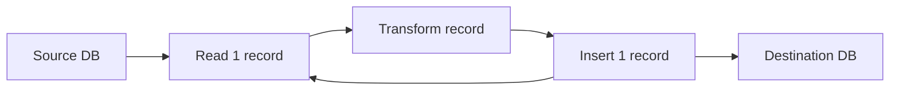
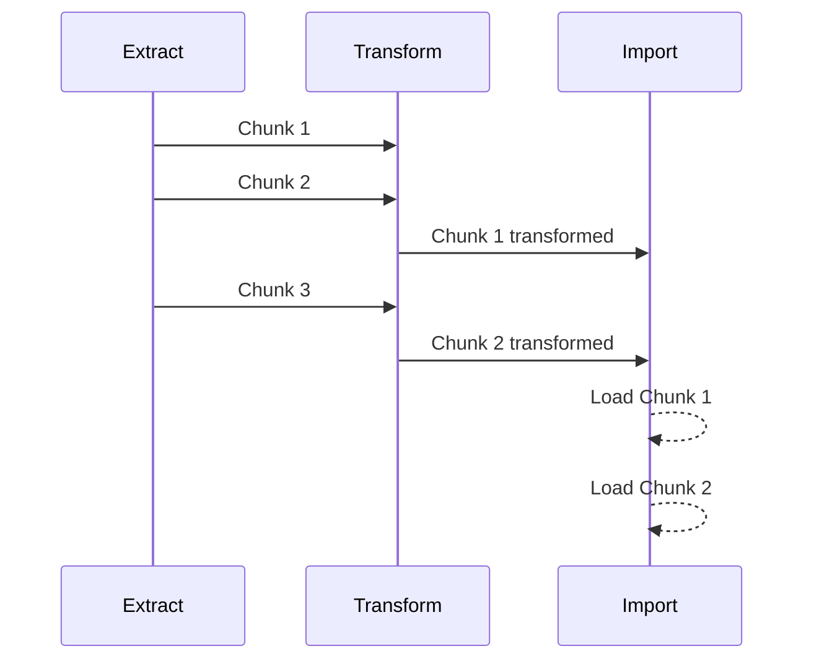
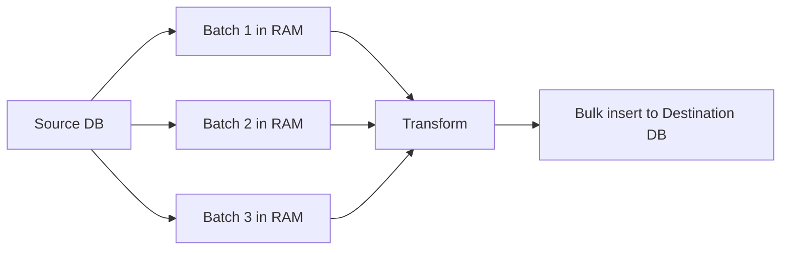
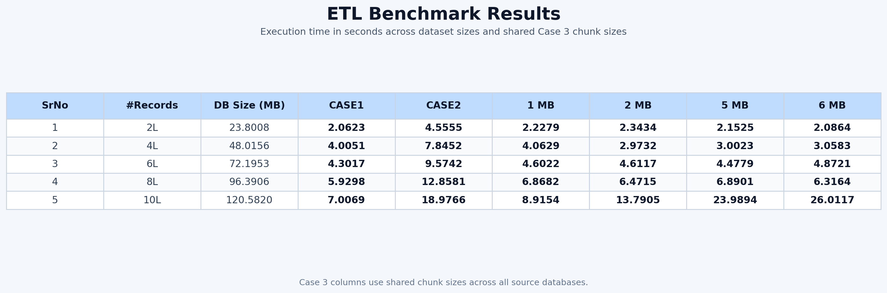
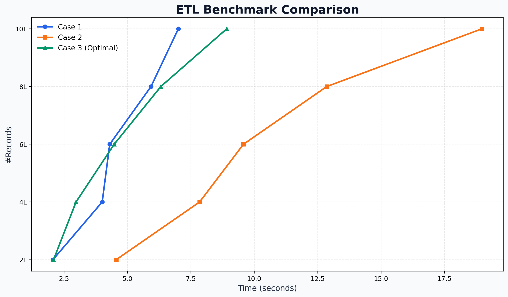

# ETL Benchmarking System

This project benchmarks three ETL strategies for moving data from a source database to a destination database with a fixed transformation pipeline. The codebase is modular, database-agnostic at the connection layer, and organized so each ETL case can be executed independently or as part of a full benchmark run.

The benchmark compares:

- Case 1: direct sequential ETL
- Case 2: staged ETL
- Case 3: pipelined multi-threaded chunk ETL

The current benchmark dataset family uses:

- `2L` records
- `4L` records
- `6L` records
- `8L` records
- `10L` records

## Problem Statement

We move rows with the schema below from a source database to a destination database:

```text
name | roll_no | email | phone_number
```

Each row is transformed during ETL:

- `name` -> uppercase
- `email` -> uppercase
- `phone_number` -> prefixed with `+91`
- `roll_no` -> prefixed with `RN_`

## Project Structure

```text
etl_project/
├── config/
│   └── config.py
├── db/
│   ├── db_connection.py
│   ├── create_db.py
│   └── schema.sql
├── data_generator/
│   └── generate_data.py
├── etl/
│   ├── case1_direct.py
│   ├── case2_file.py
│   ├── case3_parallel.py
│   └── transformations.py
├── results/
│   ├── benchmark_plot.png
│   ├── plot_results.py
│   ├── results.csv
│   └── results_table.png
├── utils/
│   ├── chunk_utils.py
│   ├── file_utils.py
│   ├── runtime_cleanup.py
│   └── timer.py
├── runtime/
│   └── datasets/
├── main.py
└── requirements.txt
```

## How The Three Cases Work

### Case 1: Direct Sequential ETL

Case 1 is the simplest possible ETL path. It reads one record from the source database, transforms it immediately, and inserts it into the destination database before moving to the next record.

This case represents a baseline implementation with minimal coordination logic and maximum per-record overhead.

Mermaid flow:



Operational characteristics:

- row-by-row fetch
- row-by-row transform
- row-by-row insert
- very easy to reason about
- higher database round-trip cost
- usually slower than batched or pipelined approaches for larger datasets

### Case 2: Staged ETL

Case 2 separates ETL into three logical stages:

1. extract the source dataset
2. transform the extracted records
3. load the transformed records

Conceptually this is a full-dataset staged ETL process. In production systems, this stage boundary may be represented by files, object storage, or in-memory collections. The important idea is that extraction and loading are no longer interleaved row-by-row as in Case 1.

Mermaid flow:


Operational characteristics:

- extraction is done as a dedicated stage
- transformation is done as a dedicated stage
- loading is done as a dedicated stage
- easier to batch aggressively than Case 1
- good model for export-transform-import workflows

### Case 3: Pipelined Multi-Threaded Chunk ETL

Case 3 splits the source dataset into chunks and processes those chunks through a three-thread pipeline:

- Extract thread
- Transform thread
- Import thread

Each stage works concurrently on different chunks. While one chunk is being transformed, the next chunk can already be extracted, and a previous chunk can already be loading into the destination database.

Mermaid flow:


Pipeline timing model:



Operational characteristics:

- work is split into chunk-sized batches
- stages overlap in time
- thread-safe queues decouple each stage
- chunk size directly affects performance
- best suited for larger datasets where pipelining and batching matter

## Pipelining And Multi-Threading

Case 3 is not just “using threads”. It is a proper pipeline.

Without a pipeline, the system would do this:

1. extract all data
2. transform all data
3. import all data

With a pipeline, the system overlaps the stages:

1. extract chunk 1
2. transform chunk 1 while extracting chunk 2
3. import chunk 1 while transforming chunk 2 and extracting chunk 3

That overlap reduces idle time across ETL stages. The extract thread does not wait for the full transformation stage to finish. The import thread does not wait for the full extract stage to finish. This is the core performance idea behind Case 3.

The implementation uses thread-safe queues:

- `extract_queue`: carries raw chunks from extract to transform
- `transform_queue`: carries transformed chunks from transform to import

This gives a clean separation of responsibilities:

- extract thread owns database reads from source
- transform thread owns transformation logic
- import thread owns batched writes to destination

## Memory-First Design

For performance-sensitive ETL, memory is usually the right transport medium.

The key idea is not “load the entire database into memory unconditionally”. The key idea is “process data in memory-sized batches”.

That distinction matters:

- small datasets can be fully materialized in memory
- larger datasets can be processed chunk-by-chunk in memory
- extremely large datasets can still avoid disk staging by streaming batches through the pipeline

In other words, a memory-based solution still works for large databases as long as the batch size is controlled.

Mermaid view of chunked in-memory processing:



Why memory is usually faster than disk staging:

- avoids repeated file writes
- avoids repeated file reads
- avoids CSV serialization and parsing overhead
- reduces filesystem latency
- keeps chunk handoff cheap between ETL stages

If the dataset is too large for full in-memory materialization, the fix is not to force disk output by default. The fix is to reduce the batch size so the system continues to work safely in memory.

Practical rule:

- full-dataset-in-memory for small datasets
- chunked/batched in-memory processing for large datasets
- persistent disk staging only when there is a strict architectural need for it

## Chunk Size Selection

Case 3 uses a shared set of chunk sizes across all benchmark datasets so the comparison remains consistent.

For the current dataset family (`2L, 4L, 6L, 8L, 10L`), the benchmark uses these shared chunk sizes:

- `1 MB`
- `2 MB`
- `5 MB`
- `6 MB`

These columns appear directly in `results.csv` as:

- `1_MB_SEC`
- `2_MB_SEC`
- `5_MB_SEC`
- `6_MB_SEC`

The best Case 3 result for each dataset is also recorded in:

- `CASE3_OPTIMAL_SEC`
- `CASE3_OPTIMAL_CHUNK_MB`

## Data Generation

The source datasets are generated from a small base record set and expanded to the required size by repetition with unique derived identifiers.

Generation characteristics:

- only a small set of base records is defined
- records are repeated until the required dataset size is reached
- generated rows are written into SQLite source databases
- source DB size is measured in MB

## Benchmark Execution

The benchmark runner is `main.py`.

It does the following:

1. ensures benchmark datasets exist
2. runs Case 1 for each dataset
3. runs Case 2 for each dataset
4. runs Case 3 for each dataset and each shared chunk size
5. writes `results.csv`
6. renders the result table image
7. renders the benchmark plot image
8. cleans temporary runtime artifacts

Run:

```powershell
py -3 main.py
```

Install dependencies first:

```powershell
py -3 -m pip install -r requirements.txt
```

## Output Artifacts

Primary output files:

- [results.csv](etl_project/results/results.csv)
- [results_table.png](etl_project/results/results_table.png)
- [benchmark_plot.png](etl_project/results/benchmark_plot.png)

Embedded benchmark visuals:

### Result Table



### Benchmark Plot



## Current Benchmark Interpretation

The results CSV and images let you answer three questions quickly:

1. How does row-by-row ETL compare with staged ETL?
2. How much does chunk size affect the multi-threaded pipeline?
3. For each dataset size, which Case 3 chunk size performs best?

In general:

- Case 1 is the simplest baseline
- Case 2 shows the benefit or cost of stage separation
- Case 3 shows how pipelining and batching behave under concurrent execution

## Notes On Temporary Artifacts

Benchmark execution treats intermediate outputs as temporary artifacts.

That means:

- destination benchmark databases can be deleted after timing
- staged export files can be deleted after timing
- runtime chunk artifacts are not kept after the run
- source benchmark databases are preserved

This keeps benchmark execution reproducible without leaving unnecessary ETL byproducts on disk.

## Future Extensions

Natural next steps for this project:

- switch the backend from SQLite to MySQL using the existing DB abstraction
- add CLI arguments for dataset selection and chunk-size overrides
- add streaming Case 2 and fully in-memory Case 2 variants
- add repeated runs and average timings for more stable benchmarking
- add memory usage and CPU usage metrics alongside execution time
